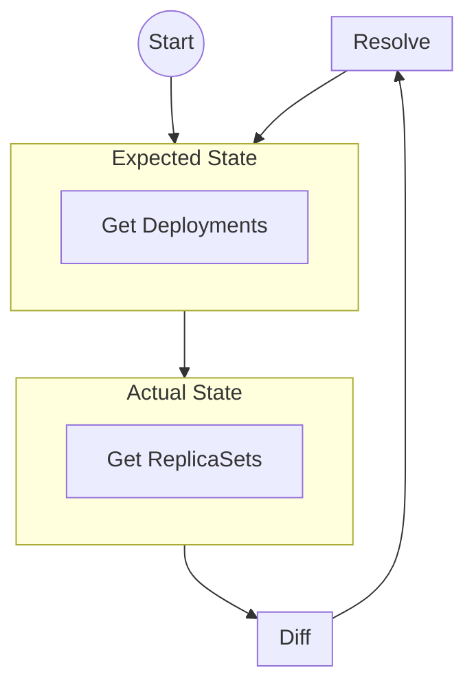

# Deployment Controller
## Role
Control Deployment Resources

## Operation Mode
Controller Loop

## Operation Flow

## Input Resources
- [Deployment](https://kubernetes.io/docs/reference/kubernetes-api/workload-resources/deployment-v1/)
## Output Resources
- [ReplicaSet](https://kubernetes.io/docs/reference/kubernetes-api/workload-resources/replica-set-v1/)

## Dependencies
- [kube-api-server](kube-api-server.md)

## Inbound communication
- `/metrics`
## Outbound communications
- [kube-api-server](kube-api-server.md)