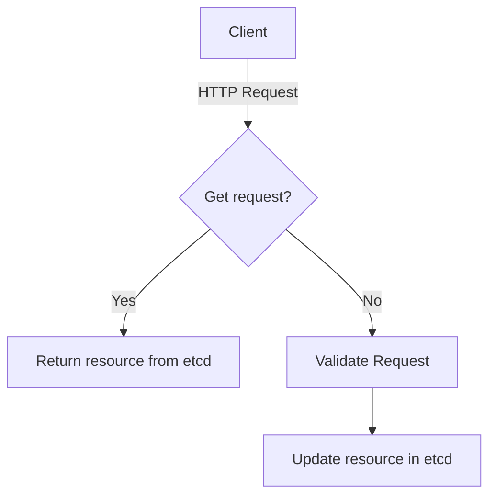

# kube-api-server
## Role
Respond to API requests (CRUD operations)
  - Query `etcd` for resources (reads)
  - Validate and write to `etcd` (create and update)
  - Remove resources from `etcd` (delete)

## Operation Mode
Request-Response

## Operation Flow

## Bonus points
[Detailed Validation Flow](https://kubernetes.io/blog/2019/03/21/a-guide-to-kubernetes-admission-controllers/#what-are-kubernetes-admission-controllers)

## Input Resources
_All_
## Output Resources
_All_

## Dependencies
- etcd

## Inbound communication
_Open_
## Outbound communications
- etcd
- kubelet*

\*kube-api-server will make outbound requests to kubelet's for servicing `log` and `exec` requests