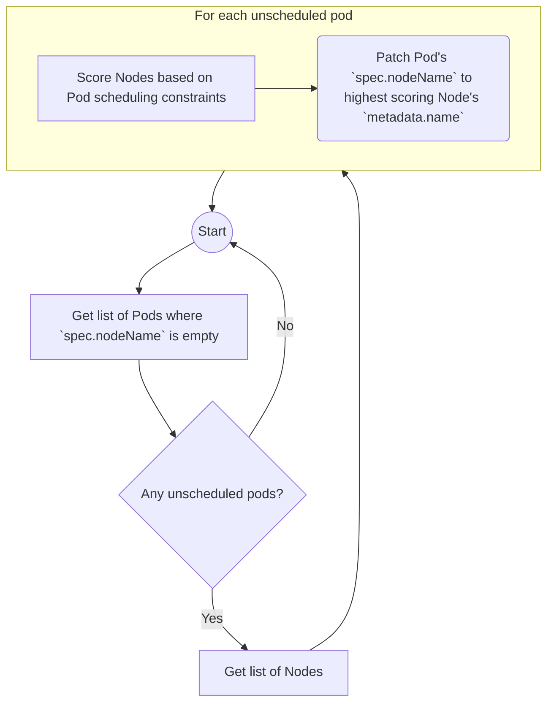

# kube-scheduler
## Role
Assign pods to nodes

## Operation Mode
Controller Loop

## Operation Flow

## Input Resources
- [Pod](https://kubernetes.io/docs/reference/kubernetes-api/workload-resources/pod-v1/)
- [Node](https://kubernetes.io/docs/reference/kubernetes-api/cluster-resources/node-v1/)
## Output Resources
_None_

## Dependencies
- [kube-api-server](kube-api-server.md)

## Inbound communication
- `/metrics`
## Outbound communications
- [kube-api-server](kube-api-server.md)