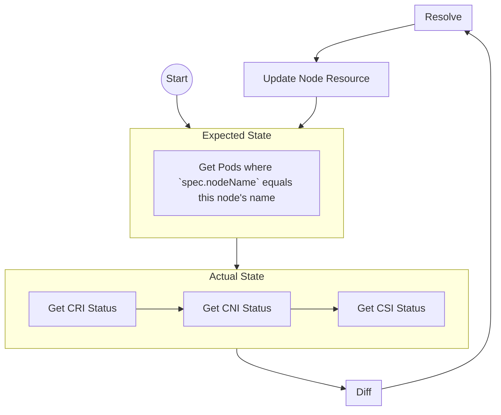

# kubelet
## Role
Execute Pods via container interfaces

## Operation Mode
Controller Loop

## Operation Flow

## Input Resources
- [Pod](https://kubernetes.io/docs/reference/kubernetes-api/workload-resources/pod-v1/)
## Output Resources
- [Node](https://kubernetes.io/docs/reference/kubernetes-api/cluster-resources/node-v1/)

## Dependencies
- [kube-api-server](kube-api-server.md)
- [CRI API](https://github.com/kubernetes/cri-api/)
- [CNI API](https://github.com/containernetworking/cni)
- [CSI API](https://github.com/container-storage-interface/spec/blob/master/spec.md)

## Inbound communication
- `/metrics`
## Outbound communications
- [kube-api-server](kube-api-server.md)